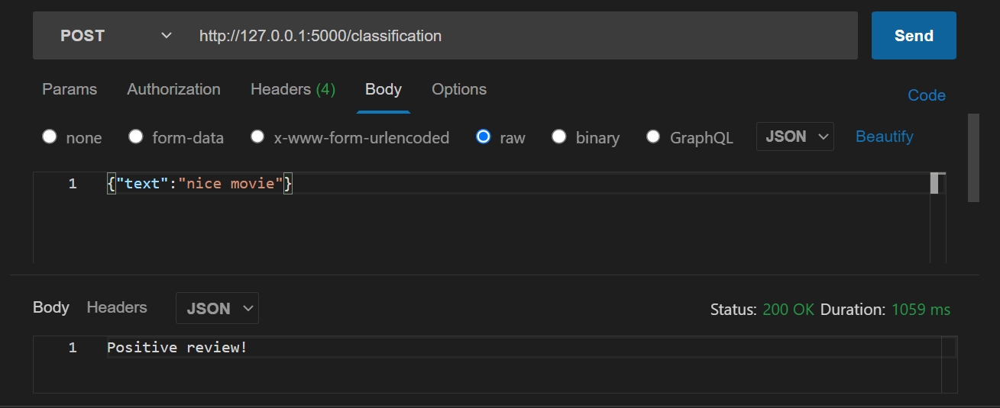

# Clasification-Reviews API JSON 
The application will classify positively or negatively the review that is entered,used from the IMBD dataset different with  JSON ,instead of using files, a json is used.

